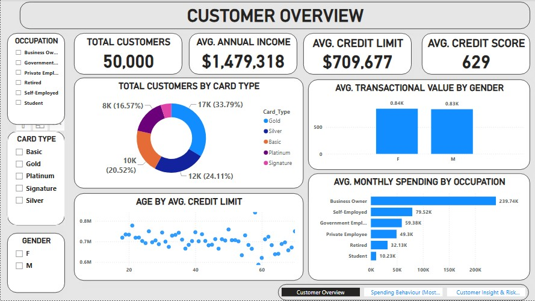
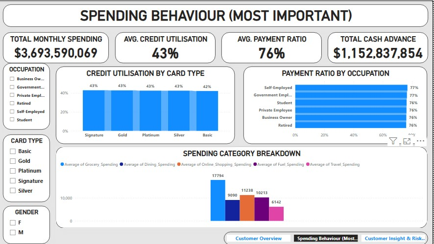
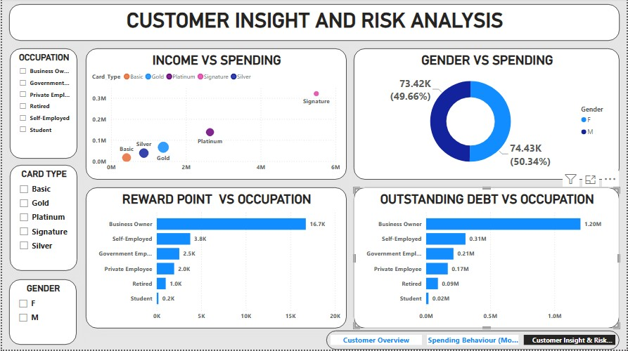

# 💳 Credit Card Customer Insight & Risk Analysis

**Prepared by:** Ubong Solomon

---

## 1. Introduction

Credit card issuers need a clear view of who their customers are, how they spend, and where credit risk is concentrated in order to make sound decisions on credit limits, rewards investment, and collections priorities. This project analyzes a credit card customer dataset through an interactive Power BI dashboard, converting raw customer, spending, and debt data into insights that support management decisions on customer segmentation, spending behaviour, and risk exposure.

The goal of this report is to summarize the dashboard's findings in a structured format for management review, and to translate the numbers into clear, actionable recommendations.

---

## 2. Data Description

The dataset underlying this dashboard covers credit card customer, spending, and risk records. Each record includes:

| Field | Description |
|---|---|
| Customer ID | Unique identifier per customer |
| Occupation | Business Owner, Government Employee, Private Employee, Retired, Self-Employed, Student |
| Card Type | Basic, Gold, Platinum, Signature, Silver |
| Gender | Female, Male |
| Age | Customer age |
| Annual Income | Customer's annual income |
| Credit Limit | Assigned credit limit |
| Credit Score | Customer credit score |
| Credit Utilisation | Share of credit limit currently in use |
| Payment Ratio | Share of statement balance paid on time |
| Cash Advance | Cash advance amount drawn |
| Monthly Spending | Total monthly spending, and by category (Grocery, Dining, Online Shopping, Fuel, Travel) |
| Reward Points | Reward points accumulated |
| Outstanding Debt | Outstanding debt balance |

**Scope:** 50,000 customers, filterable by Occupation, Card Type, and Gender.

---

## 3. Methodology

The analysis followed these steps:

1. **Data consolidation** – Customer profile, spending, and debt/risk records were combined into a single structured table.
2. **Data cleaning** – Records were checked for missing values, consistent occupation/card type naming, and correct categorization of spending fields.
3. **Aggregation** – Income, spending, credit utilisation, payment ratio, reward points, and outstanding debt were aggregated by occupation, card type, gender, and age.
4. **Visualization** – Aggregated measures were built into an interactive Power BI dashboard across three pages (Customer Overview, Spending Behaviour, Customer Insight and Risk Analysis) using KPI cards, a donut chart, a scatter plot, and bar charts, with slicers for Occupation, Card Type, and Gender.
5. **Interpretation** – Patterns in the visualized data were reviewed to identify where spending and risk concentrate, and to surface priority areas for management attention.

**Tool used:** Power BI Desktop

---

## 4. Analysis and Findings 

### 4.1 Overall Performance

| Metric | Value |
|---|---|
| Total Customers | **50,000** |
| Average Annual Income | **$1,479,318** |
| Average Credit Limit | **$709,677** |
| Average Credit Score | **629** |
| Total Monthly Spending | **$3,693,590,069 (~$3.69B)** |
| Average Credit Utilisation | **43%** |
| Average Payment Ratio | **76%** |
| Total Cash Advance | **$1,152,837,854 (~$1.15B)** |

An average payment ratio of 76% alongside 43% average credit utilisation suggests a generally healthy base overall, though — as later sections show — this masks meaningful concentration of spending and debt in specific occupation segments.

### 4.2 Customers by Card Type
- Gold: **17,000 (33.79%)**
- Silver: **12,000 (24.11%)**
- Basic: **10,000 (20.52%)**
- Platinum: **8,000 (16.57%)**
- Signature: **~3,000 (~6.0%)**

Gold is the most common card type by a wide margin, while Signature — the premium tier — is held by only a small fraction of the customer base.

### 4.3 Spending by Gender
- Female: **$0.84K average transaction value; 73.42K (49.66%) share of total spending**
- Male: **$0.83K average transaction value; 74.43K (50.34%) share of total spending**

Spending behaviour is essentially gender-neutral, with both average transaction value and overall spending share nearly identical between genders.

### 4.4 Average Monthly Spending by Occupation
- Business Owner: **$239.74K**
- Self-Employed: **$79.52K**
- Government Employee: **$59.38K**
- Private Employee: **$49.3K**
- Retired: **$32.13K**
- Student: **$10.23K**

Business Owners spend roughly **3x more** than the next-highest segment (Self-Employed) and over **23x more** than Students.

### 4.5 Age vs. Average Credit Limit
Credit limit is relatively flat to slightly declining with age, hovering mostly between $0.65M and $0.75M across the 20–70 age range, with no strong age-driven trend.

### 4.6 Credit Utilisation by Card Type 
- Signature: **43%**
- Gold: **43%**
- Platinum: **43%**
- Silver: **43%**
- Basic: **42%**

Credit utilisation is essentially flat across every card tier — card type is not a meaningful differentiator of utilisation behaviour.

### 4.7 Payment Ratio by Occupation
- Self-Employed: **77%**
- Government Employee: **77%**
- Student: **76%**
- Private Employee: **76%**
- Business Owner: **76%**
- Retired: **76%**

Like credit utilisation by card type, payment ratio is nearly flat across occupations (76%–77%) — a weak differentiator on its own.

### 4.8 Spending Category Breakdown (Average)
- Grocery Spending: **17,794**
- Online Shopping Spending: **11,238**
- Fuel Spending: **10,213**
- Dining Spending: **9,090**
- Travel Spending: **6,142**

Grocery is the leading spending category by a clear margin, more than 1.5x the next-highest category (Online Shopping).

### 4.9 Income vs. Spending by Card Type  
- Basic: lowest income and spending   
- Silver: modestly higher than Basic
- Gold: moderate income and spending
- Platinum: markedly higher income (~$2.3M) and spending (~$0.19M)
- Signature: highest income (~$5.3M) and spending (~$0.28M) by a wide margin

Spending rises consistently with both income and card tier, with Signature cardholders — the smallest segment by count (Section 4.2) — standing out as the highest-value customers by far.

### 4.10 Reward Points by Occupation
- Business Owner: **16.7K**
- Self-Employed: **3.8K**
- Government Employee: **2.5K**
- Private Employee: **2.0K**
- Retired: **1.0K**
- Student: **0.2K**

### 4.11 Outstanding Debt by Occupation
- Business Owner: **$1.20M**
- Self-Employed: **$0.31M**
- Government Employee: **$0.21M**
- Private Employee: **$0.17M**
- Retired: **$0.09M**
- Student: **$0.02M**

Business Owners lead every value metric — spending, reward points, and outstanding debt alike — by a wide margin over every other occupation segment.

---

## 5. Key Insight

- **Business Owners are the single most important segment on every dimension.** They lead in monthly spending ($239.74K), reward points (16.7K), and outstanding debt ($1.20M) — all by a wide margin over the next-highest occupation.
- **Signature cardholders are a small but exceptionally high-value segment.** At only ~6% of customers, they show the highest income and spending of any card tier by a wide margin.
- **Card type and occupation do not meaningfully differentiate credit behaviour.** Credit utilisation (42–43%) and payment ratio (76–77%) are essentially flat across every card type and occupation — the differentiation lies in spending and debt levels, not repayment discipline.
- **Gender is not a meaningful driver of spending.** Average transaction value and total spending share are nearly identical between Female and Male customers.
- **Grocery dominates spending category mix**, ahead of Online Shopping, Fuel, Dining, and Travel — useful context for rewards and partnership design.
- **Age has little relationship to credit limit**, suggesting credit limits are being set on factors other than age alone (consistent with income- and card-tier-driven patterns seen elsewhere in the data).

---

## 6. Recommendation

1. **Build a dedicated relationship-management program for Business Owners and Signature cardholders**, given their outsized spending, reward accumulation, and outstanding debt relative to every other segment.
2. **Reassess Signature card acquisition strategy** — given its small base (~6% of customers) but exceptional income and spending profile, targeted growth in this tier could be highly value-accretive.
3. **Monitor outstanding debt concentration in the Business Owner segment specifically** ($1.20M, over 3x the next-highest occupation), given the collections and credit risk implications of concentrated exposure.
4. **Use spending category data (Grocery-led) to guide rewards and partner-category design**, since Grocery, Online Shopping, and Fuel together dominate spend.
5. **Do not rely on card type or occupation alone as risk signals** — since credit utilisation and payment ratio are flat across these dimensions, risk models should incorporate income, spending level, and outstanding debt instead.
6. **Continue monitoring credit limit policy against age**, since the current flat relationship suggests limits are (appropriately) not being driven by age, but this is worth periodically validating against fair-lending considerations.

---

## 7. Conclusion

Across 50,000 credit card customers with $3.69B in total monthly spending, the portfolio shows a generally healthy repayment profile (76% average payment ratio, 43% average credit utilisation) that is remarkably consistent across card types and occupations. The real differentiation lies elsewhere: Business Owners and Signature cardholders — though a small share of the customer base — drive a disproportionate share of spending, rewards, and outstanding debt. Gender shows little effect on spending behaviour, and age shows little effect on credit limit, while occupation and card tier are strongly tied to income and spending intensity. Acting on the recommendations in this report — prioritizing high-value segment management, monitoring debt concentration among Business Owners, and building risk models around spending and income rather than card type or occupation alone — can help management deepen relationships with the most valuable customers while keeping portfolio risk well understood.

---

**Prepared by:** Ubong Solomon
